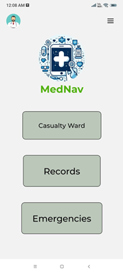

This is a React Native application dedicated and tailored to meet the unique needs of nurses working in casualty wards when doctors may not be readily available. In these circumstances, the app serves as a reliable resource for primary medications and first aid, enabling nurses to provide essential care swiftly and effectively. This initiative aims not only to enhance the overall quality of patient care but also to streamline communication between nurses and doctors, ensuring that crucial information is conveyed promptly, even in the absence of direct physical presence.

The application collects a range of patient data, including symptoms, age, and blood type, and uses a machine learning algorithm to diagnose a disease and suggest medications with 90% accuracy. In case of an emergency, the nurse can either consult a doctor or administer the recommended medications directly. The patient’s data can be saved in the database, and once treatment is completed, the data can be removed. Additionally, the application features an emergency tab that provides users with essential first aid instructions for handling injuries.

# 1. Home

  
  
This is some text that starts from the left and wraps around the image. You can keep typing here, and the text will flow around the image until it reaches the bottom of the image, after which it will continue normally.

