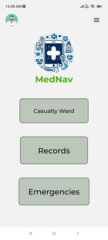
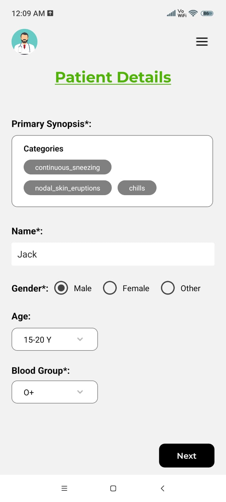
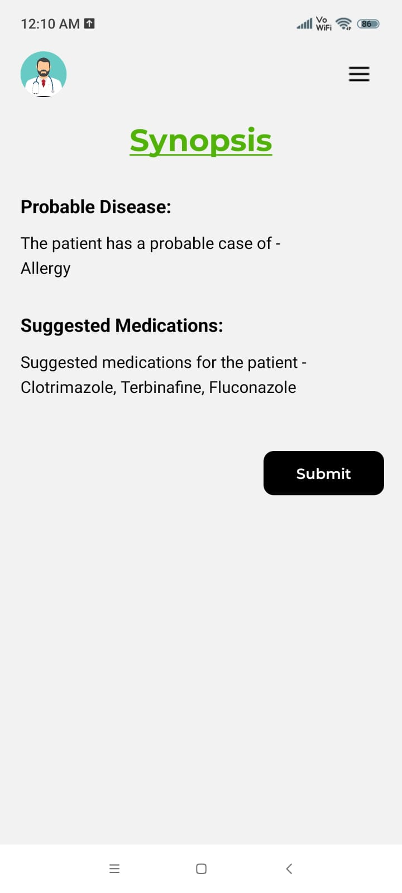
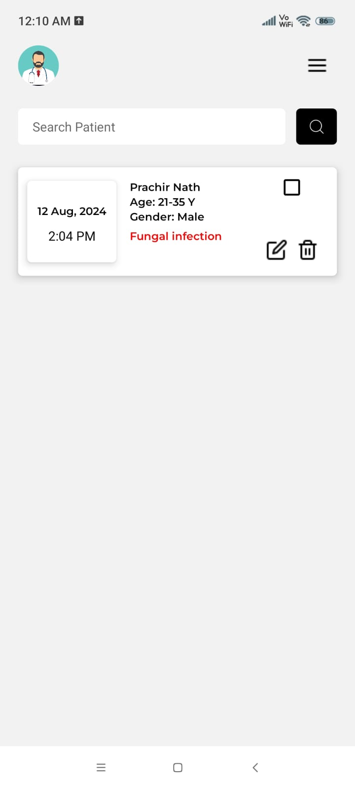
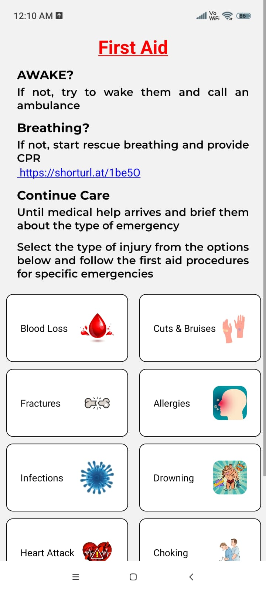

This is a React Native application dedicated and tailored to meet the unique needs of nurses working in casualty wards when doctors may not be readily available. In these circumstances, the app serves as a reliable resource for primary medications and first aid, enabling nurses to provide essential care swiftly and effectively. This initiative aims not only to enhance the overall quality of patient care but also to streamline communication between nurses and doctors, ensuring that crucial information is conveyed promptly, even in the absence of direct physical presence.

The application collects a range of patient data, including symptoms, age, and blood type, and uses a machine learning algorithm to diagnose a disease and suggest medications with 90% accuracy. In case of an emergency, the nurse can either consult a doctor or administer the recommended medications directly. The patient’s data can be saved in the database, and once treatment is completed, the data can be removed. Additionally, the application features an emergency tab that provides users with essential first aid instructions for handling injuries.

# 1. Home

This is the home page of the application, featuring three tabs: Casualty, Records, and Emergency. The Casualty tab allows doctors and nurses to use a machine learning algorithm to accurately predict diseases and recommend medications based on patient data, such as symptoms, blood group, and age. The Records tab stores information on admitted patients, while the Emergency tab provides the general public with essential first aid instructions for various injury situations.

# 2. Casualties1

This is the page where the patient's  data will be collected.

# 3. Casualties2

After the machine learning algorithm accurately predicts the disease and medications, they will be displayed on this page. The patient's data can then be stored by pressing the submit button.

# 4. Records

The records tab stores the data of the admitted patients. Doctors can check on these patients through this app and edit the medications if it is required. After the patient is properly treated, they can be removed from the database.
# 5. Emergency

This is the Emergency tab which provides the general public with essential first aid instructions for various injury situations.
